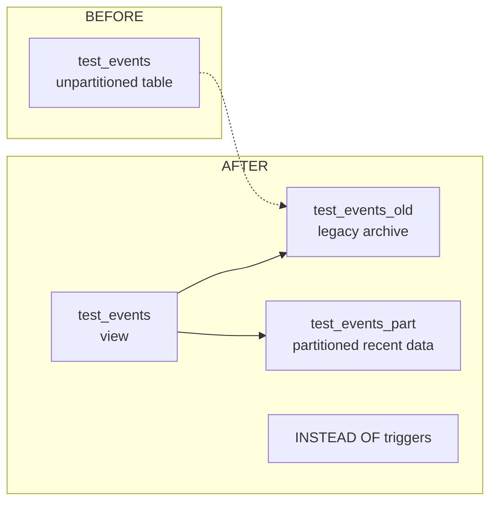

# oracle-routing-to-partitioned-table

## Problem context

This repository shows how to transform a single unpartitioned Oracle table into a hybrid design that keeps recent event data in a partitioned table while moving older data into a legacy table.

The source system starts with one table that stores all rows. The goal is to retain only the last 90–120 days of data in the partitioned table for performance, while still keeping older data available through a unified view.

Use case:
- keep recent rows fast and easy to query,
- avoid growing the active table indefinitely,
- preserve read access to historical data through a single logical object.

## Table structure

### Original table

`test_events`
- `event_id NUMBER PRIMARY KEY`
- `user_id NUMBER`
- `event_data VARCHAR2(4000)`
- `created_date DATE DEFAULT SYSDATE`
- `event_type VARCHAR2(100)`

This is the initial unpartitioned table used for inserts and queries.

### Partitioned table

`test_events_part`
- columns: `event_id`, `user_id`, `event_data`, `created_date`, `event_type`
- partitioned by `RANGE(created_date)`
- monthly `INTERVAL (NUMTOYMINTERVAL(1, 'MONTH'))`
- initial partition: `p_old VALUES LESS THAN (DATE '2026-06-01')`

This table stores the most recent rows and uses interval partitioning for efficient date-based retention.

### Legacy table

`test_events_old`
- same schema as `test_events`
- stores rows older than the recent retention window

### Unified view

`test_events`
- a `UNION ALL` view over `test_events_old` and `test_events_part`
- used as the logical access point for reads and write routing triggers

## Scripts

### `create.sql`

Purpose: create the initial source table and optionally populate it with sample data.

What it does:
- drops `TEST_EVENTS` if it exists,
- creates `test_events` with the original schema,
- inserts sample rows for validation / demonstration.

### `partition.sql`

Purpose: convert the existing schema into a partitioned recent-data table plus legacy archive table, then install routing triggers.

What it does:
- drops existing triggers, view, and tables used by the sample setup,
- creates `test_events_part` as an interval-partitioned table,
- renames `test_events` to `test_events_old`,
- creates the unified view `test_events`,
- installs `INSTEAD OF` triggers on the view for `INSERT`, `DELETE`, and `UPDATE`.

Routing logic:
- rows with `created_date >= SYSDATE - 90` are routed to `test_events_part`,
- older rows are routed to `test_events_old`.

### `test.sql`

Purpose: verify that the routing and partitioning behavior works as intended.

What it does:
- inserts controlled test rows,
- commits the changes,
- checks row counts in `test_events_old`, `test_events_part`, and the unified view,
- inspects partition metadata for `TEST_EVENTS_PART`.

## Architecture before / after

## Notes

- The cutoff is currently `SYSDATE - 90`; change it to `SYSDATE - 120` if you need a 120-day retention window.
- The scripts drop objects at the top, so use them carefully outside a test environment.
- Update the hard-coded partition boundary in `partition.sql` to match your deployment date range.
