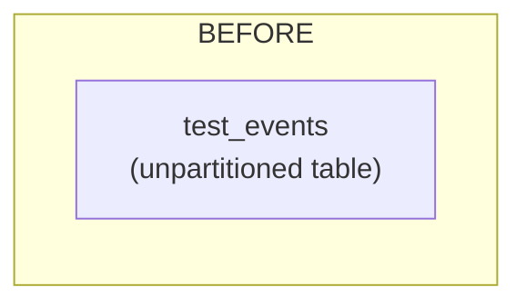
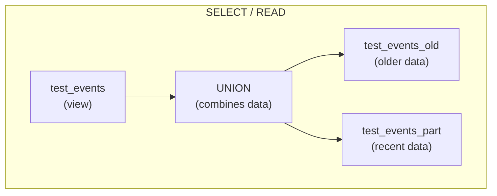
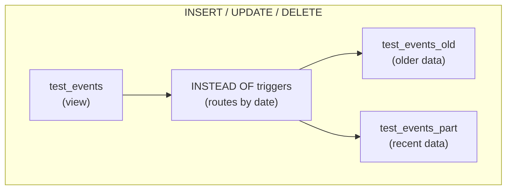

## The Problem
You have an unpartitioned table with millions (potentially billions) of old events piling up. The recent events (last 90 days) are queried constantly, but older data is not needed anymore due to compliance requirements. A huge table gets slow, and traditional row deletion takes a long time and impacts performance.

## The Solution: Two Tables + Routing

**Before:**
```
test_events (2 million+ rows)
├─ Recent data (frequently queried)
└─ Old data (will not be needed in the future)
```

**After:**
```
test_events (VIEW - appears like one table to users)
├─ test_events_part (recent data: last 90 days)
│  └─ Partitioned by month for speed (could be paritioned by day / week if needed)
└─ test_events_old (old table)
```

## The Three Scripts

### 1. **create.sql** — Setup
- Creates an initial table
- Populates it with 2 million fake rows (for testing)

### 2. **partition.sql** — The Transformation
- Renames the original table to `test_events_old` (old data)
- Creates a new partitioned table `test_events_part` (recent data)
- Creates a VIEW named `test_events` that shows both tables combined (using a union)
- Adds **INSTEAD OF triggers** (automatic routers):
  - **INSERT:** New rows go to `test_events_part` if they're ≤ 90 days old, otherwise to `test_events_old`
  - **UPDATE/DELETE:** Routes to the correct table based on the row's date

Users still query/update `test_events`, but the triggers silently route data to the right physical table.

### 3. **test.sql** — Verification
- Inserts test rows with different dates
- Confirms they ended up in the correct table:
  - Today's date → `test_events_part` ✓
  - 30 days ago → `test_events_part` ✓
  - 100 days ago → `test_events_old` ✓

## Why This Helps
✅ Recent data stays fast (smaller, partitioned table)  
✅ Old data stays accessible (archived table)  
✅ Single query point for users (the VIEW)  
✅ Automatic routing (triggers do the work)  
✅ Space considerations (you can drop partitions after a specific period)

## Architecture BEFORE



## Architecture AFTER





## Notes 

- The cutoff is currently `SYSDATE - 90`; change it to `SYSDATE - 120` if you need a 120-day retention window.
- The scripts drop objects at the top, so use them carefully outside a test environment.
- Update the hard-coded partition boundary in `partition.sql` to match your deployment date range.

> **⚠️ Important:** Tested in isolation only - further validation with your application stack is recommended (for example, ORM integration).
